# Defi Oracle Meta Payment Gateway Project with GRU Integration

This comprehensive README unifies traditional SWIFT/ISO 20022 messaging with central‑bank digital currency rails on the Defi Oracle Meta Mainnet, featuring the gold‑backed **Global Reserve Unit (GRU)**. It enables seamless bank‑to‑bank and fintech‑to‑traditional‑bank payments, on/off‑ramp plumbing, and preserves fractional‑reserve monetary policy.

---

## Table of Contents
1. [Overview](#overview)
2. [Problem Statement](#problem-statement)
3. [Proposed Solution](#proposed-solution)
4. [Monetary Model with GRU](#monetary-model-with-gru)
5. [Architectural Overview](#architectural-overview)
6. [Workflows](#workflows)
   - [Legacy SWIFT MT‑103](#legacy-swift-mt-103)
   - [DeFi Oracle Meta + GRU Alternative](#defi-oracle-meta--gru-alternative)
   - [ISO 20022 & gpi Integration](#iso-20022--gpi-integration)
   - [Side‑by‑Side Comparison](#side-by-side-comparison)
7. [Core Components](#core-components)
8. [Pointer Architecture](#pointer-architecture)
9. [On‑Ramp Capabilities](#on-ramp-capabilities)
10. [Off‑Ramp Capabilities](#off-ramp-capabilities)
11. [Gateway Application Example](#gateway-application-example)
12. [Liquidity & Risk Management](#liquidity--risk-management)
13. [Compliance & Legal](#compliance--legal)
14. [Security & Audit](#security--audit)
15. [Technical Architecture](#technical-architecture)
    - [Microservices & CI/CD](#microservices--cicd)
    - [Smart Contracts & GRU Issuance](#smart-contracts--gru-issuance)
    - [API Endpoints & Schemas](#api-endpoints--schemas)
16. [Developer Experience & Monitoring](#developer-experience--monitoring)
17. [Operational Resilience](#operational-resilience)
18. [Benefits](#benefits)
19. [Usage Example](#usage-example)
20. [Contributing](#contributing)
21. [License](#license)

---

## 1. Overview
Embed a 35‑char SolaceNet pointer in SWIFT/ISO 20022 messages and route minimal GRU‑M1 transfers on‑chain. This yields:

- **Unlimited metadata** off‑chain via pointer JSON
- **Immediate finality** through blockchain settlement
- **Dual reconciliation** with SWIFT gpi and on‑chain events
- **Gold‑backed** central‑bank currency preserving reserve ratios
- **Compliance**, auditability, and scalable on/off‑ramp plumbing

## 2. Problem Statement
- SWIFT fees and 1–3 day delays
- Tag‑length limits prevent rich metadata
- Fragmented reconciliation across rails
- Crypto‑asset risk and regulatory uncertainty

## 3. Proposed Solution
1. **Pointer Code** in SWIFT Tag 70 / ISO 20022 remittanceInfo
2. **GRU Token Layers**: M1, M0, M00 on Defi Oracle Meta
3. **Fractional‑Reserve Logic** in smart contracts
4. **On/Off‑Ramp** to fiat rails using GRU instead of stablecoins
5. **Resolver API** for full metadata fetch
6. **Integration** with SWIFT gpi, ISO 20022, and on‑chain oracles

## 4. Monetary Model with GRU
All value uses **Global Reserve Unit (GRU)**, backed by on‑chain gold:

- **M00 (Treasury Reserves)**: Over‑collateralized 120 % XAU backing, held by government treasuries.
- **M0 (Base Money)**: Minted 1:1 against locked M00 by central banks; commercial banks obtain M0 for lending.
- **M1 (Transactional Money Supply)**: Freely transacted; minted up to 5 × M1 per 1 × M0 deposit by commercial banks.

### Fractional‑Reserve Mechanics
On each **M1 transfer**, the protocol sequesters:
- **20 % of transferred M1 equivalent in M0**
- **4 % of transferred M1 equivalent in M00**

These reserves are locked in a **Systemic Reserves Contract** to maintain ratios.


Recommendations:
- **Gold‑Price Oracle**: Chainlink XAU/USD feed to enforce 120 % collateral.
- **Governance DAO**: Multi‑sig for adjusting ratios, collateral factors.
- **Proof‑of‑Reserve**: On‑chain snapshots + Merkle proofs.

## 5. Architectural Overview

```mermaid
flowchart TB
  A[Customer App] --> B[Gateway API]
  B -->|Generate SNREF| C[Pointer Service]
  C -->|Store JSON| D[(SolaceNet DB)]
  C -->|Return SNREF| B
  B -->|Build SWIFT/ISO20022| E[SWIFT gpi/XML]
  E -->|Deliver| F[Receiver Adapter]
  F -->|Extract SNREF| G[Resolver API]
  G -->|Return Payload| F
  F -->|Trigger On‑Chain| H[Settlement Contract]
  H -->|Emit Event| I[Systemic Reserves Contract]
  I -->|Lock Reserves| J[Reserve Vaults]
  H -->|Event| K[Off‑Ramp Worker]
  K -->|SEPA/Wire| L[Beneficiary Bank]
``` 


## 6. Workflows

### Legacy SWIFT MT‑103


### DeFi Oracle Meta + GRU Alternative


### ISO 20022 & gpi Integration
- **Pain.001**: `<Ustrd>SNREF…</Ustrd>`
- **Pacs.008**: `<RmtInf><Ustrd>SNREF…</Ustrd>`
- **gpi**: Pair tracker status with on‑chain TX hashes.

### Side‑by‑Side Comparison


## 7. Core Components
- **Gateway API**: Accepts payments, issues SNREF
- **Pointer Service**: SNREF generator & encrypted JSON store
- **SolaceNet DB**: K/V store with TTL & encryption
- **SWIFT Adapter**: gpi FIN / ISO20022 XML builder
- **Resolver API**: Secured fetch of pointer metadata
- **Settlement Contracts**: `mintM1`, `mintM0`, `mintM00`, reserve‑lock hooks
- **Systemic Reserves**: Locks M0/M00 per transfer
- **On/Off‑Ramp Workers**: Fiat ↔ GRU integration

## 8. Pointer Architecture
- **Format**: `SNREFYYYYMMDD-<HEX>` ≤35 chars
- **Regex**: `^[A-Z0-9\-]{1,35}$`
- **JSON schema** includes version, amounts, accounts, txHash, timestamp, checksum
- **Lifecycle**: TTL (1 hr), manual revoke API

## 9. On‑Ramp Capabilities
- GRU‑M1 mint instead of stablecoin
- Partners: Central bank interfaces, custody platforms
- Best‑rate routing among on‑ramp providers
- Pooled IBAN accounts for netting
- Real‑time widget with KYC flow and status updates

## 10. Off‑Ramp Capabilities
- GRU‑M1 burn and redeem to fiat
- Multiple rails: SEPA, Fed‑wire, Faster Payments
- Auto‑routing, batching, and reconciliation ledger
- Event‑driven off‑ramp triggers

## 11. Gateway Application Example
```js
app.post('/payments', async (req,res)=>{
  const snref=generateSNREF();
  await storePointer(snref,{amount,beneficiary,...});
  const mt103=buildMT103(req.body,snref);
  await swiftClient.send(mt103);
  res.json({snref});
});
``` 

## 12. Liquidity & Risk Management
- Seed GRU‑M1 pools on L1/L2
- Automated rebalancing jobs
- Credit lines with central/government banks
- Market‑making bots for narrow spreads
- Throttles & velocity limits

## 13. Compliance & Legal
- Unified KYC/KYB via JWT tokens
- Real‑time AML screening & thresholds
- Automated CTR/SAR and audit logs
- Data residency & privacy compliance (GDPR, CCPA)

## 14. Security & Audit
- mTLS/OAuth2 for services
- SAST/DAST in CI (SonarQube, OWASP ZAP)
- Formal verification of reserve logic
- HSM/KMS for contract keys
- Bug‑bounty program for GRU modules

## 15. Technical Architecture

### Microservices & CI/CD
- Dockerized services, Helm charts
- Kubernetes clusters, GitHub Actions pipelines
- Terraform for infra as code

### Smart Contracts & GRU Issuance
- Solidity 0.8.x, OZ upgradable proxies
- Functions: `mintM00`, `mintM0`, `mintM1`, `lockReserves` hooks
- Events: `M1Minted`, `ReservesLocked`, `M0Minted`, `M00Minted`
- Hardhat/Foundry tests ≥90% coverage

### API Endpoints & Schemas
- `POST /v1/onramp/initiate` → SNREF + GRU‑M1 mint instructions
- `GET /v1/onramp/status/{snref}` → status, txHash, metadata
- `POST /v1/offramp/initiate` → burn M1 & SEPA payout
- `GET /v1/offramp/status/{snref}` → redemption status, fiatRef
- Webhooks: `pointer.created`, `m1.minted`, `reserve.locked`, `offramp.completed`

## 16. Developer Experience & Monitoring
- Local testnet + fiat simulator sandbox
- SDKs: JS/TS, Python, Go
- CLI: `sn-cli pointer create`, `sn-cli onramp status`
- Observability: Prometheus, Grafana, Loki, Sentry
- Alerts: Slack/PagerDuty for SLA exceptions

## 17. Operational Resilience
- Geo‑distributed deployments
- Circuit breakers & failover strategies
- Chaos testing & DR playbooks
- Automated backups & DB snapshots

## 18. Benefits
- **Cost savings**: ~90% lower vs. SWIFT fees
- **Speed**: Minutes to finality
- **Data richness**: Unlimited metadata via pointer
- **Auditable**: Dual‑ledger reconciliation
- **Gold‑backed**: Trustworthy, over‑collateralized GRU

## 19. Usage Example
```bash
curl -X POST /v1/onramp/initiate -d '{"amount":500,"beneficiary":"DE...","currency":"EUR"}'
# → {"snref":"SNREF20250420-ABC123...","instructions":{...}}
``` 

## 20. Contributing
- Fork & branch `feature/<desc>`
- PRs require tests, docs updates, lint pass
- Adhere to code of conduct & security policy

## 21. License
MIT License. Use, modify, and distribute freely.
